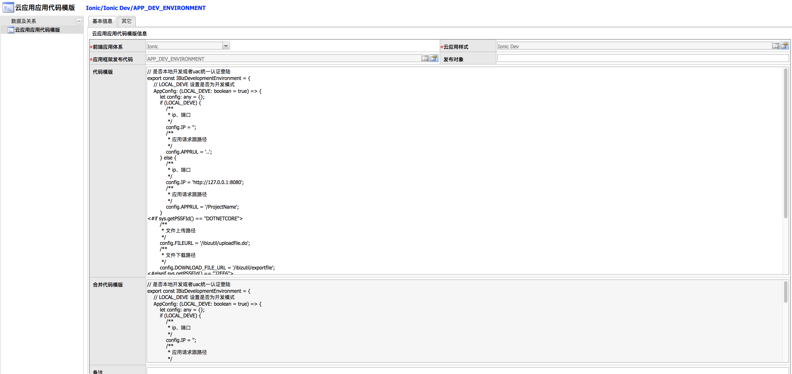

### 2018年6月9日

#### 1.向导视图：
##### (1).新增样式宏 IONIC_VIEW_CTRL_BASE_IMPORT_WIZARD:
> 代码：
##### (2).新增实体移动端向导视图的 SERVICE_TS、HTML、SCSS、MODULE_TS、CONTROLLER_TS、CONTROLLER_BASE_TS：
> 代码：
> 代码：
> 代码：
> 代码：
> 代码：
> 代码：
##### (3).新增部件代码 HTML、SERVICE_TS:
> 代码：
> 代码：

#### 2.新增应用代码模板 APP_DEV_ENVIRONMENT：
> 代码：