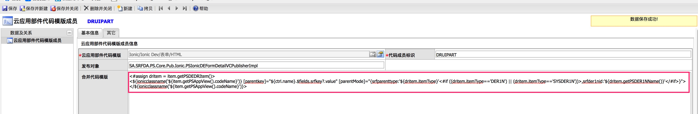
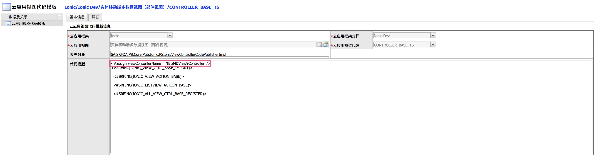
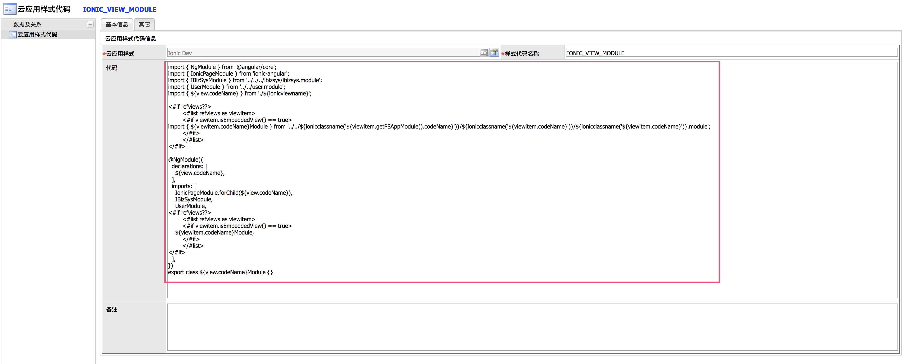

### 2018年5月29日

#### 1.修改移动端数据选择编辑器HTML模板：

> 修改：删除textItem="customname"属性  
> 代码：

#### 2.新增表单嵌入表格功能(平台新增参数，发布器也有更改。需平台先更新，不可单独更新。)：
##### (1).修改表单部件(HTML)成员DRUIPART:
> 修改：全部代码
> 代码：
##### (2).修改实体移动端多数据视图（部件视图）的 CONTROLLER_BASE_TS：
> 修改：替换继承的类：
> 代码：
##### (3).修改样式宏IONIC_VIEW_MODULE:
> 修改：全部代码
> 代码：