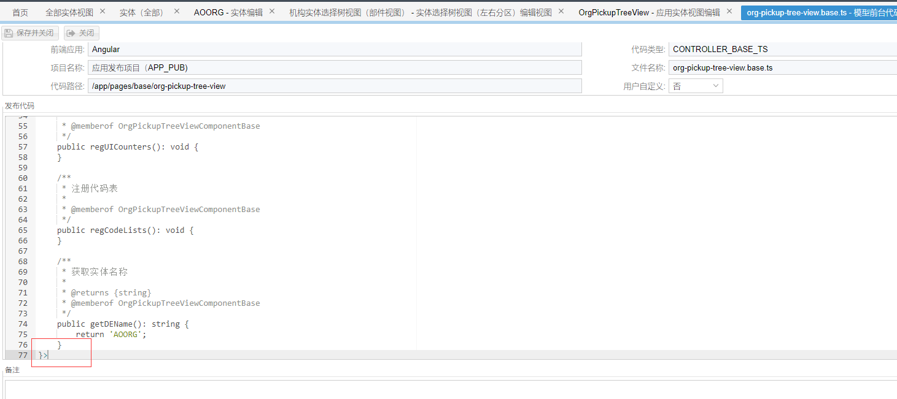
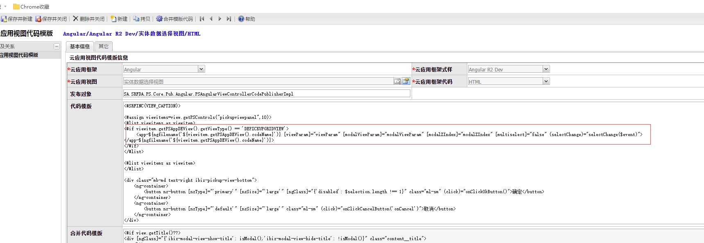
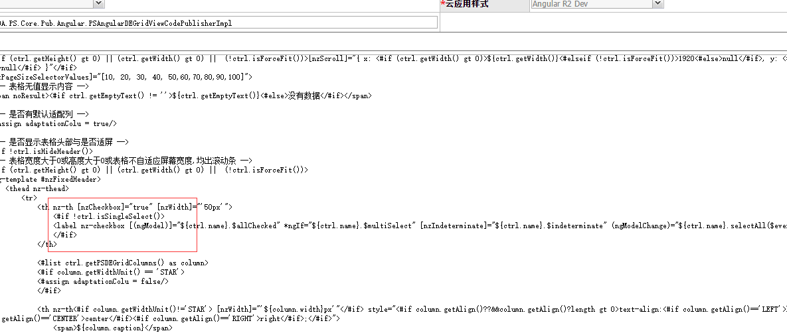
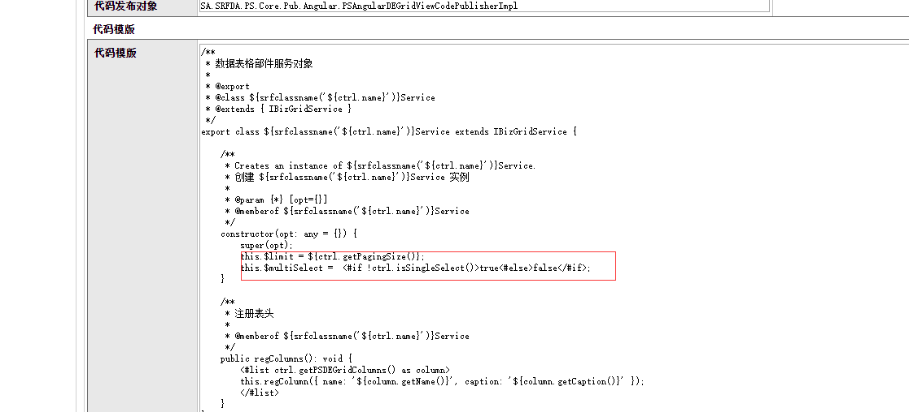

### 2018.05.29
#### 1. 视图代码模板实体选择树视图（部件视图）CONTROLLER_BASE_TS 文件

>功能：修改模板编写异常问题   
>代码：   

#### 2. 视图代码模板实体数据选择视图 HTML 文件

>功能：增加代码类型判断   
>代码： 

#### 3. 部件代码模板数据表格 HTML、SERVICE_TS 文件

>功能：增加是否选中判断、增加是否支持多选、修复分页设置bug  
>代码：    