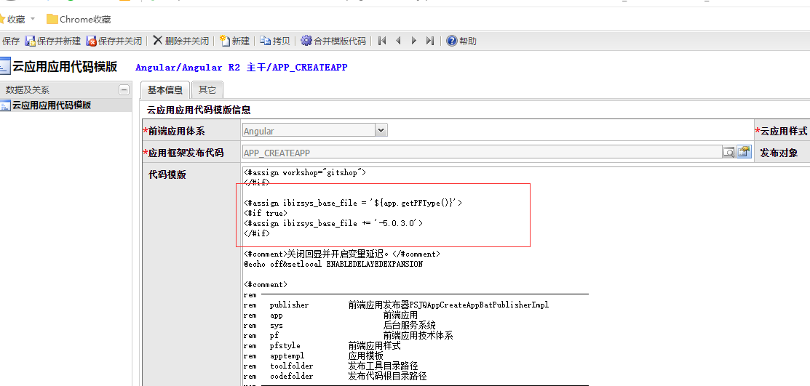
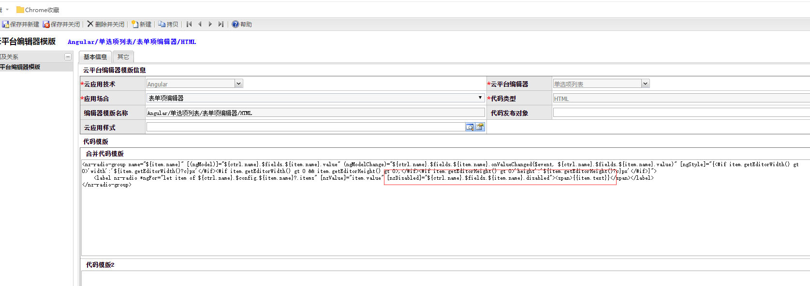
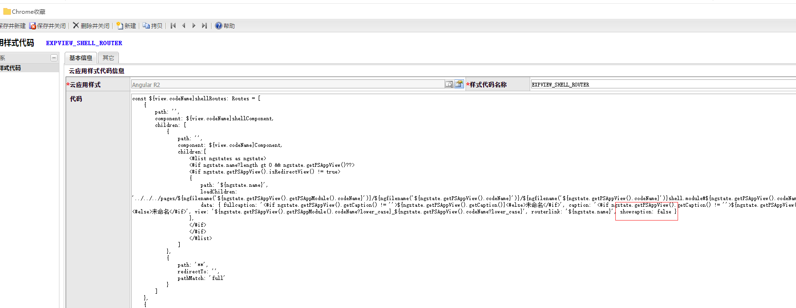
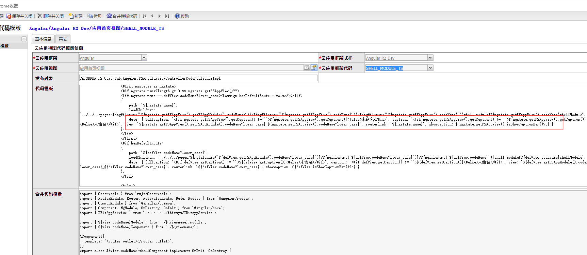

### 2018.05.29
#### 1. 视图代码模板实体选择树视图（部件视图）CONTROLLER_BASE_TS 文件

>功能：修改模板编写异常问题   
>代码： 

*****

### 2018.05.28 

#### 1. 修改应用代码模板文件 APP_CREATEAPP 

>功能：基础文件增加版本号，本次更新版本ANGULAR-5.0.3.0  
>代码： 
>基础文件地址：https://github.com/zcdtk/JQuery_Translate_Angular.git

#### 2. 编辑器模板多行文本输入框HTML文件

>功能：表单对象动态绑定   
>代码：   

#### 3. 编辑器模板单选项列表HTML文件  

>功能：代码异常修改   
>代码： 

#### 4. 宏文件 EXPVIEW_SHELL_ROUTER

>功能：取消显示导航数据信息   
>代码：   

#### 5. 视图代码模板，应用首页视图SHELL_MODULE_TS文件

>功能：修复首页导航面包屑参数设置  
>代码： 
