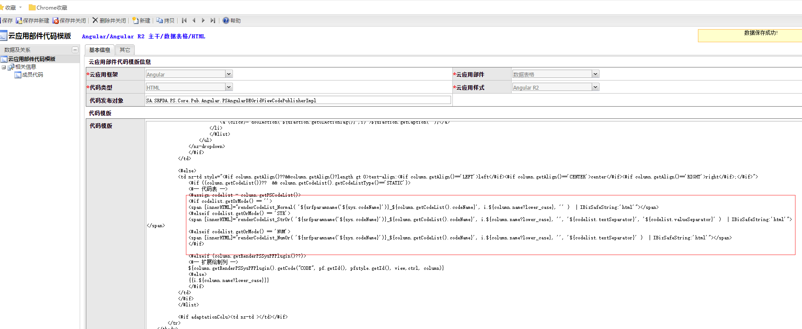
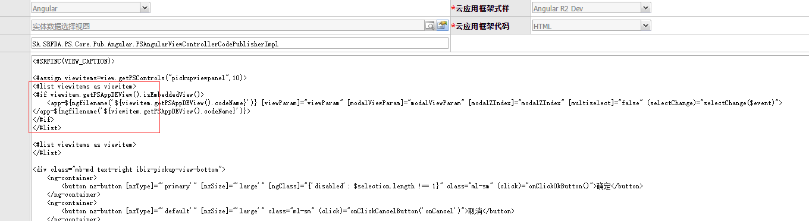

### 2018.06.08

#### 1.应用代码模板 createapp 文件  样式版本号增加非空判断

-------

### 2018.06.07

#### 1.搜索表单自定义表单项扩展功能支持修复

-------

### 2018.06.04

#### 1. 部件代码模板 数据表格 HTML文件

>功能：支持代码表多项或模式（文本或模式、数值或模式） 
>代码： 

#### 2. 视图代码模板 实体数据多项选择视图、实体数据选择视图 HTML文件

>功能：添加数据选择视图视图限制，只支持部件视图 
>代码： 

