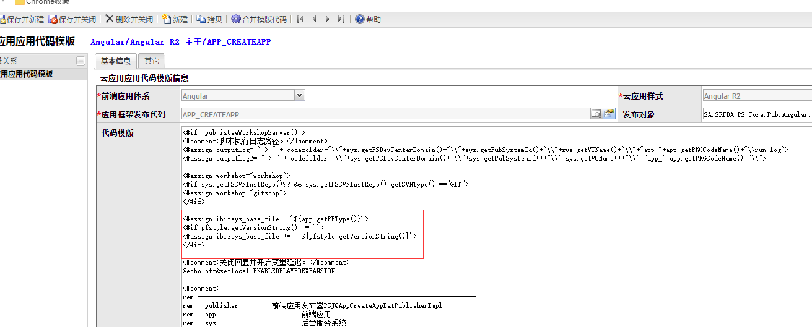

### 2018.05.30

#### 1. 视图代码模板 实体图表视图 SHELL_MODULE_TS文件

>功能：修改模板代码编写异常 

*********

### 2018.05.30

#### 1. 编辑器模板 文本框、多行输入框（10行） HTML文件

>功能：值单项绑定，失去焦点后，更新数据 
>代码： 
>
>代码： 

#### 2. 应用代码模板 APP_CREATEAPP 文件

>功能：基础准备文件版本动态化 
>代码： 
